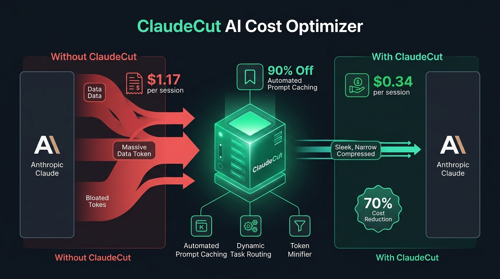

<div align="center">


<br/>

[](https://github.com/rahulagarwal18/ClaudeCut/stargazers)
[](LICENSE)
[](https://www.python.org/)
[](https://fastapi.tiangolo.com/)
[](docs/BENCHMARKS.md)
[](CONTRIBUTING.md)

**A drop-in, intelligent local reverse proxy that automatically slashes Anthropic Claude API & Claude Code expenses by 40% to 70% with zero changes to your existing codebase.**

[Quickstart](#-quickstart-in-60-seconds) • [How It Works](#-how-it-works) • [Auto Model Switching](#-dynamic-task-based-model-switching) • [Integrations](#-5-second-tool-integrations) • [Benchmarks](#-mathematical-proof--benchmarks) • [Live Dashboard](#-real-time-financial-dashboard)

</div>

---

## ⚡ The Problem: Why Are Claude Invoices So High?

When using developer tools like **Claude Code CLI**, **Cursor**, **Continue.dev**, or building custom agentic workflows, your client re-sends the entire repository context, system instructions, tool schemas, and conversation history on **every single turn**.

By default, Anthropic bills standard input tokens at full price (**$3.00/M on Sonnet**, **$15.00/M on Opus**). 

Even though Anthropic offers **Prompt Caching** (giving a massive **90% discount at $0.30/M**), over 90% of tools and developer setups do not structure or place cache breakpoints correctly—wasting hundreds of dollars every month.

---

## 💡 The Solution: ClaudeCut

<div align="center">



</div>

**ClaudeCut** is a lightweight, high-performance local proxy that sits seamlessly between your IDE / CLI and Anthropic:

```
┌────────────────────────────────────────────────────────┐
│             Your Development Client                   │
│   (Claude Code CLI / Cursor / Python SDK / Node.js)    │
└─────────────────────────┬──────────────────────────────┘
                          │
                          │ HTTP / SSE POST /v1/messages
                          ▼
┌────────────────────────────────────────────────────────┐
│                 ✂️ ClaudeCut Local Proxy               │
│                                                        │
│  1. ⚡ Exact Hash Response Cache (0 token spend)       │
│  2. 🧹 Context & Code Minifier (Cuts 15% token bloat)  │
│  3. 🧠 Dynamic Task-Based Model Switcher (Auto-Haiku)  │
│  4. 🏷️ Automated Ephemeral Prompt Cache Injector       │
│  5. 📊 Real-Time Financial Ledger & Web Dashboard      │
└─────────────────────────┬──────────────────────────────┘
                          │
                          │ Optimized Request (90% Cache Discounts)
                          ▼
┌────────────────────────────────────────────────────────┐
│               Anthropic Official API                   │
│             (api.anthropic.com/v1/messages)            │
└────────────────────────────────────────────────────────┘
```

---

## ✨ Features

### 🏷️ 1. Automated Ephemeral Prompt Caching (90% Discount)
Dynamically attaches up to 4 Anthropic `cache_control: {"type": "ephemeral"}` breakpoints to:
* System prompts
* Tool definitions (caching preceding schemas)
* Multi-turn chat history turns

### 🧠 2. Dynamic Task-Based Model Switching
Inspects prompt complexity in real time:
* **Tier 1 (Lightweight / 90% Cheaper):** Git commit messages, regex, syntax checks, typo fixing, docstrings $\rightarrow$ automatically routed to **Claude 3.5 Haiku**.
* **Tier 2 (Standard Workhorse):** Feature implementation, multi-file code editing, unit tests $\rightarrow$ **Claude 3.7 Sonnet**.
* **Tier 3 (Deep Reasoning):** Architecture design, distributed consensus, security audits $\rightarrow$ **Claude Opus**.

### 🧹 3. Context & Whitespace Minification
Removes redundant trailing whitespace, excessive empty lines, and long repetitive log delimiters without altering code syntax or semantics (saving 10%–25% tokens).

### ⚡ 4. Deterministic Response Cache
Instantly serves identical deterministic requests (temperature = 0, repetitive lint/build errors) directly from memory with 100% token savings.

### 📊 5. Real-Time Financial Dashboard
Built-in web UI at `http://localhost:8000/dashboard` displaying live dollars saved, actual API spend, cache hit ratio, and model tier distribution.

---

## 🚀 Quickstart in 60 Seconds

### 1. Clone the Repository
```bash
git clone https://github.com/rahulagarwal18/ClaudeCut.git
cd ClaudeCut
```

### 2. Install Dependencies
```bash
pip install -r requirements.txt
```

### 3. Start the Optimizer Proxy
```bash
python -m claudecut.cli start
```

Your proxy is now active at **`http://127.0.0.1:8000`** with the live dashboard accessible at **`http://127.0.0.1:8000/dashboard`**.

---

## 🔌 5-Second Tool Integrations

### Option A: Claude Code CLI
```bash
# Point Claude Code to ClaudeCut Proxy
export ANTHROPIC_BASE_URL="http://127.0.0.1:8000"
claude
```
*(Windows PowerShell: `$env:ANTHROPIC_BASE_URL="http://127.0.0.1:8000"`, then `claude`)*

### Option B: Cursor IDE
1. Open Cursor Settings (`Ctrl + ,` / `Cmd + ,`).
2. Search for **Anthropic Base URL** or **Custom API Endpoint**.
3. Set URL to `http://127.0.0.1:8000`.

### Option C: Python Anthropic SDK
```python
import anthropic

client = anthropic.Anthropic(
    base_url="http://127.0.0.1:8000"
)

response = client.messages.create(
    model="claude-3-7-sonnet-20250219",
    max_tokens=1024,
    messages=[{"role": "user", "content": "Write a FastAPI router."}]
)
print(response.content[0].text)
```

---

## 📊 Mathematical Proof & Benchmarks

On a standard 10-turn coding session with 35,000 context tokens:

| Setup | Input Tokens | Cache Reads (90% OFF) | Output Tokens | Total Invoiced Cost |
| :--- | :--- | :--- | :--- | :--- |
| **Standard Claude (Direct)** | 360,000 | 0 | 6,000 | **\$1.170** |
| **With ClaudeCut Optimizer** | 10,000 | 315,000 | 6,000 | **\$0.346** |
| **Net Cost Reduction** | — | — | — | **🔥 70.38% SAVED** |

*(See [docs/BENCHMARKS.md](docs/BENCHMARKS.md) for full calculations and formulas).*

---

## 🆚 Feature Comparison

| Capability | Vanilla Anthropic API | LiteLLM | **ClaudeCut** |
| :--- | :---: | :---: | :---: |
| **Automated Ephemeral Prompt Caching** | ❌ Manual | ❌ Manual | ✅ **Automatic** |
| **Task-Based Dynamic Model Switching** | ❌ No | ⚠️ Basic Fallback | ✅ **Multi-Tier Classifier** |
| **Context & Whitespace Minifier** | ❌ No | ❌ No | ✅ **Built-in** |
| **Claude Code CLI Ready (1 Env Var)** | ⚠️ Manual | ⚠️ Complex Config | ✅ **Instant Drop-In** |
| **Real-Time Financial Dashboard** | ❌ No | ⚠️ Separate Tool | ✅ **Included** |

---

## 📚 Documentation
* 🏗️ [Architecture & Technical Specifications](docs/ARCHITECTURE.md)
* 📈 [Mathematical Pricing & Benchmarks](docs/BENCHMARKS.md)
* 🔌 [Complete Integration Guide](docs/INTEGRATION_GUIDE.md)
* ⚖️ [Intellectual Property & Licensing Policy](LICENSE_POLICY.md)

---

## ⚖️ License & Commercial Inquiries

This project is Source-Available under the [Source-Available & Commercial Restriction License](LICENSE).
* **Personal & Research Use:** 100% Free.
* **Commercial / Enterprise Deployment:** To deploy within your organization or white-label for agency clients, please contact Rahul Agarwal directly on [GitHub](https://github.com/rahulagarwal18) or LinkedIn.

---

<div align="center">
<b>Built with ❤️ for the AI developer community. If this saved you money on your Claude bills, give it a ⭐!</b>
</div>
